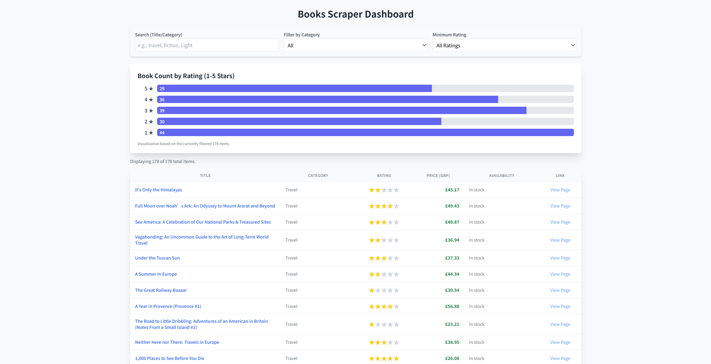

# React Dashboard UI — Book Scraper Visualization

This folder contains the React-based dashboard used to browse, filter, and visualize book data scraped from **books.toscrape.com**.

The UI loads the JSONL data generated by the scraper and provides a clean, interactive interface for exploring all scraped items.


##   Features

### **1. Data Loading from JSONL**
The UI loads book records from:

```
public/data/items.jsonl
```

A custom loader (`loadData.ts`) parses JSONL line-by-line and converts each record into a typed `BookItem`.

### **2. Interactive Filters**
- Text search (title / category)
- Category dropdown filter  
- Minimum rating filter  

### **3. Sortable Table**
- Sort by price  
- Sort by rating  
- Sort by category  
- Sort by title (alphabetical)

### **4. Visual Analytics**
A horizontal bar chart summarizes book counts by rating (1–5 stars), dynamically updating based on filters.

### **5. Lightweight & Fast**
- Fully client-side  
- No backend needed  
- Suitable for static deployment (GitHub Pages, Netlify, Vercel, etc.)


##  File Structure

```
ui/
│
├── public/
│   └── data/
│       └── items.jsonl          # Scraper-mirrored dataset (auto-updated)
│
├── src/
│   ├── lib/
│   │   └── loadData.ts          # JSONL reader and type coercion
│   │
│   ├── components/
│   │   ├── Table.tsx            # Paginated, sortable book table
│   │   ├── Filters.tsx          # Search + category + rating controls
│   │   └── Chart.tsx            # Rating distribution bar chart
│   │
│   ├── types.ts                 # BookItem TypeScript type
│   ├── App.tsx                  # Main dashboard layout
│   └── main.tsx                 # React mountpoint
│
└── package.json
```


##  Running the UI

### Install dependencies:

```
npm install
```

### Start development server:

```
npm run dev
```

UI will be available at:

```
http://localhost:5173
```

### Build for production:

```
npm run build
```

### Preview production build:

```
npm run preview
```


##  Data Flow: How UI Gets Data

The scraper automatically writes items into this path:

```
ui/public/data/items.jsonl
```

This means:

- No manual file copying is needed  
- UI instantly reflects new scraper output  

The loader:

```ts
loadScrapedData()
```

parses each line into a `BookItem`, ignoring blank or malformed lines.


##  BookItem Schema (Version 1)

```
{
  title: string,
  price: number,
  availability: string,
  rating: number,
  category: string,
  url: string,
  image_url?: string,
  schema_version: 1
}
```

The UI is compatible with future schema versions via the version flag.


##  Design Principles

- Simple, reliable data loader  
- All UI behavior is derived from state (React Hooks)  
- Clear separation of logic into components  
- Functional and easy to extend  


##  Screenshot 



##  Notes

- UI does not modify data  
- UI safely handles missing or malformed fields  
- Deployed UI can run as a fully static site  

---

This UI is designed to be a clean, polished visualization layer for the scraper dataset.
